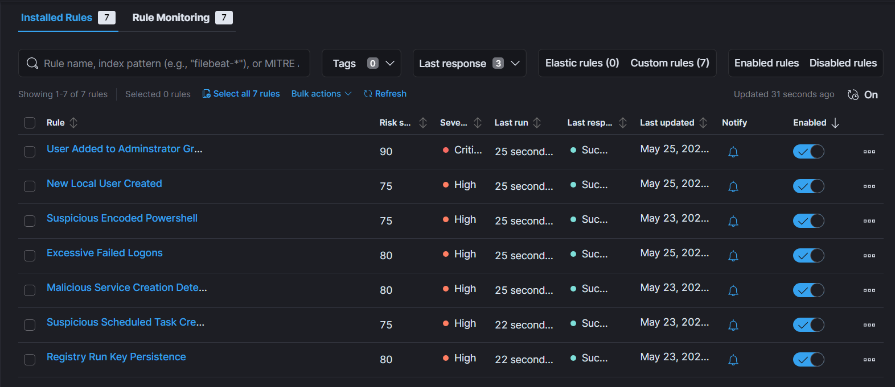
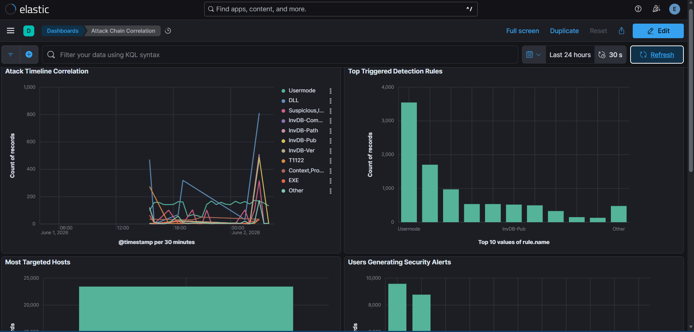

# Detection Analysis Phase

## Objective

Validate that Elastic SIEM successfully detected and correlated the attack activity performed throughout the simulation.

This phase focuses on analyzing alerts generated during Reconnaissance, Execution, Persistence, and Privilege Escalation activities to confirm proper detection coverage and visibility.

---

## Detection Coverage

The following attack activities were performed and successfully detected:

| Attack Activity                    | MITRE ATT&CK Technique                         | Detection Status |
| ---------------------------------- | ---------------------------------------------- | ---------------- |
| Nmap Port Scanning                 | T1046 - Network Service Discovery              | Detected         |
| Malicious Service Creation         | T1543.003 - Create or Modify System Process    | Detected         |
| Scheduled Task Creation            | T1053.005 - Scheduled Task                     | Detected         |
| Registry Run Key Persistence       | T1547.001 - Registry Run Keys / Startup Folder | Detected         |
| User Added to Administrators Group | T1098 - Account Manipulation                   | Detected         |

---

## Evidence Collected

### 1. Alert Overview

Security Alerts dashboard showing all detections generated during the attack simulation.

---

### 2. Rule Validation

Detection rules enabled within Elastic SIEM. These custom rules generated alerts for each simulated attack activity.

Validated Rules:

* Suspicious Scheduled Task Creation
* Malicious Service Creation Detection
* Registry Run Key Persistence
* User Added to Administrator Group

---

### 3. Attack Chain Correlation

Attack Chain dashboard displaying correlated attack activity across multiple stages of the intrusion lifecycle.

The dashboard demonstrates how individual events can be linked together to provide a complete picture of attacker behavior.

---

## MITRE ATT&CK Mapping

| Attack Phase         | Technique                                          | MITRE ID  |
| -------------------- | -------------------------------------------------- | --------- |
| Reconnaissance       | Network Service Discovery                          | T1046     |
| Execution            | Scheduled Task Creation                            | T1053.005 |
| Execution            | Create or Modify System Process (Service Creation) | T1543.003 |
| Persistence          | Registry Run Keys / Startup Folder                 | T1547.001 |
| Privilege Escalation | Account Manipulation                               | T1098     |

The attack simulation exercised multiple MITRE ATT&CK techniques commonly observed during real-world intrusions. Detection rules successfully generated alerts for each technique, validating the SIEM's ability to identify activity across multiple stages of the attack lifecycle.

---

## Detection Results

| Detection Rule                       | Result   |
| ------------------------------------ | -------- |
| Suspicious Scheduled Task Creation   | Detected |
| Malicious Service Creation Detection | Detected |
| Registry Run Key Persistence         | Detected |
| User Added to Administrator Group    | Detected |

---

## Key Findings

* Elastic SIEM successfully ingested Windows endpoint telemetry and Sysmon logs.
* Custom detection rules generated alerts for all simulated attack activities.
* Multiple attack techniques were correlated across the attack chain.
* High-severity and critical alerts were generated for persistence and privilege escalation activities.
* The environment successfully demonstrated end-to-end detection engineering and SOC monitoring capabilities.

---

## Outcome

The Detection Analysis phase confirmed that Elastic SIEM successfully detected, correlated, and visualized attack activity across Reconnaissance, Execution, Persistence, and Privilege Escalation phases.

A total of multiple high-severity and critical alerts were generated during testing, validating custom detection rules and demonstrating end-to-end visibility from attacker action to analyst investigation.

This project demonstrates practical experience with:

* Elastic SIEM
* Detection Engineering
* Threat Hunting
* Security Monitoring
* Sysmon
* Windows Event Analysis
* MITRE ATT&CK Mapping
* Attack Chain Correlation

The completed environment provides a realistic SOC analyst workflow, including attack simulation, detection validation, alert investigation, and incident analysis.

