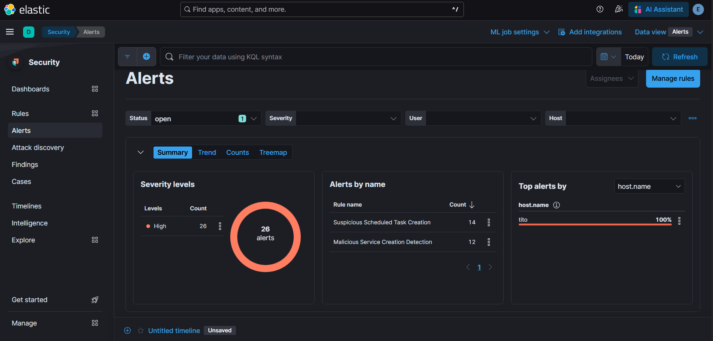
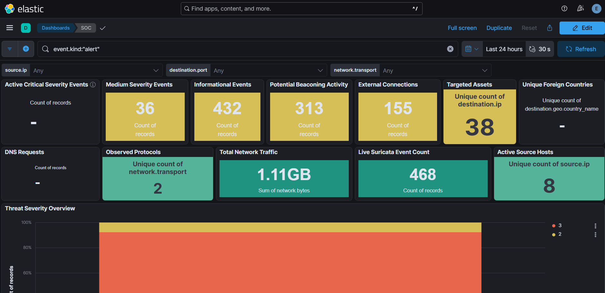
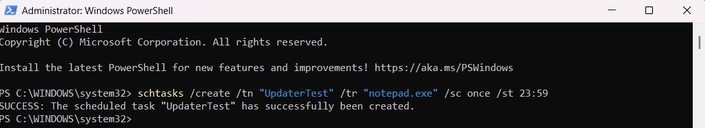
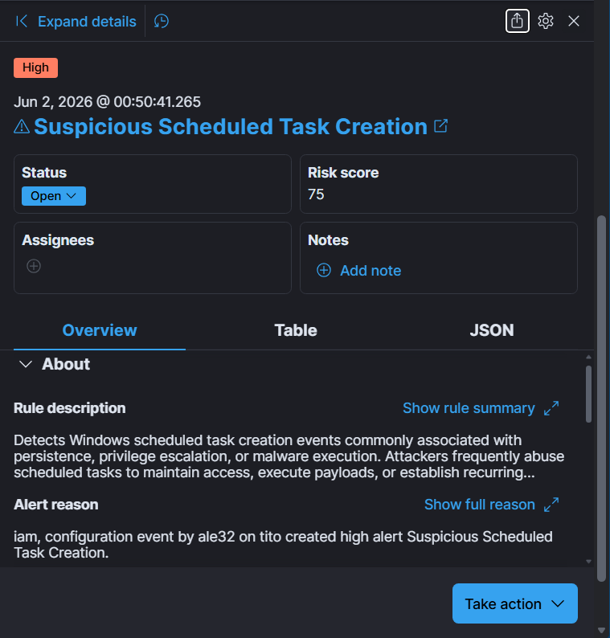
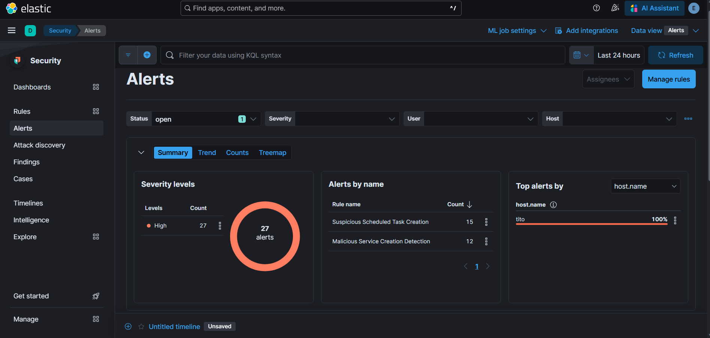

# Execution Phase

## Objective

Simulate attacker execution activity and validate the SOC's ability to detect suspicious process execution through custom Elastic detection rules.

---

## Attack Simulation

A scheduled task was created using the Windows `schtasks` utility to simulate attacker execution behavior commonly associated with persistence and malware deployment.

This activity was designed to generate telemetry through Sysmon and Windows Event Logs and trigger the custom Elastic detection rule developed during the Detection Engineering phase.

MITRE ATT&CK Technique:

- T1053.005 – Scheduled Task/Job: Scheduled Task

---

## Activity Performed

A scheduled task was created on the monitored Windows endpoint using Windows Task Scheduler.

The action generated Windows Event Logs that were collected by Sysmon and Winlogbeat, forwarded to Elastic SIEM, and analyzed by the custom detection rule.

The Elastic Security platform successfully detected the activity and generated a high-severity alert.

Detection Rule Triggered:

- Suspicious Scheduled Task Creation

---

## Evidence

### 00 – Baseline Before Execution

Environment state prior to execution activity.

---

### 01 – SOC Dashboard Before Execution

SOC dashboard showing baseline alert volume before attack simulation.

---

### 02 – Scheduled Task Creation Command

Execution activity performed on the monitored Windows endpoint.

---

### 03 – Suspicious Scheduled Task Alert

Elastic Security successfully detected the activity and generated an alert.

---

### 04 – Alerts After Execution

SOC dashboard showing increased alert volume after execution activity was performed.

---

## Detection Analysis

The generated telemetry was successfully ingested into Elastic Security and correlated against the custom detection logic.

Analysis confirmed:

- Scheduled task creation activity was recorded by Windows Event Logs.
- Sysmon captured the associated process execution.
- Winlogbeat forwarded telemetry to Elastic SIEM.
- Elastic Security generated a high-severity alert.
- Alert details were available for investigation and triage within the SOC workflow.

---

## Results

The custom detection rule successfully identified and alerted on the scheduled task creation event.

Validation confirmed:

- Sysmon telemetry collection
- Winlogbeat log forwarding
- Elastic Security detection rule functionality
- Alert generation and investigation workflow
- End-to-end visibility from endpoint activity to SOC dashboard

The execution phase successfully demonstrated that attacker activity could be detected, investigated, and correlated within the AI-Assisted SOC Platform.

---

## Lessons Learned

This phase demonstrated the importance of validating detection rules through controlled attack simulation rather than relying solely on rule creation.

Building a detection is only the first step. Detection validation confirms that telemetry is collected correctly, alerts are generated as expected, and analysts have the visibility necessary to investigate suspicious activity.

Successful completion of this phase provided confidence that the environment was ready for more advanced attack simulations involving persistence, privilege escalation, attack-chain correlation, and AI-assisted alert triage.
