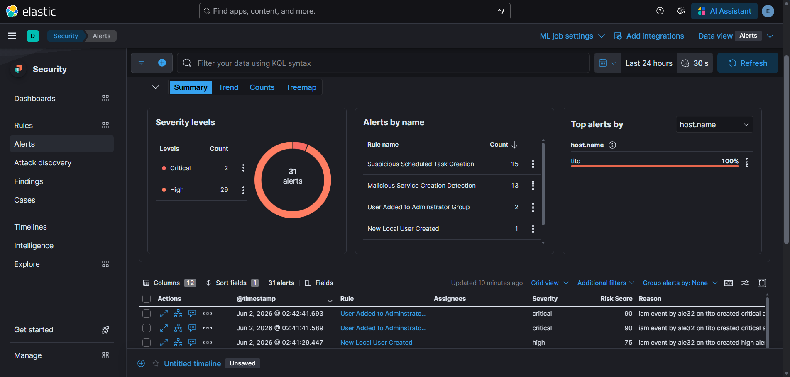
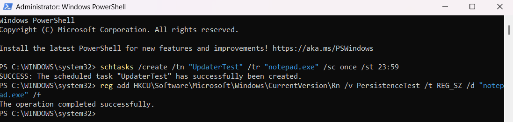
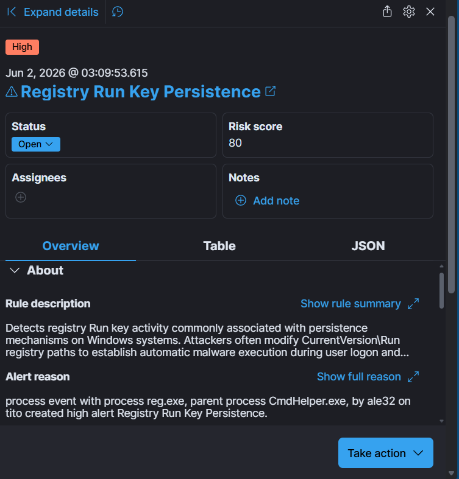
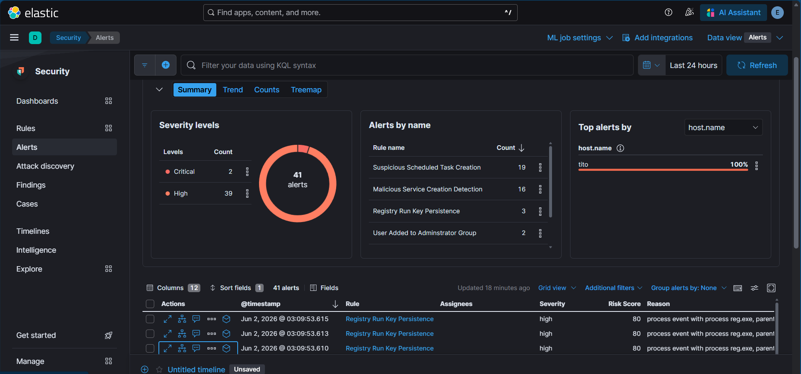

# Persistence Phase

## Objective

Simulate attacker persistence by creating a Windows Registry Run Key that automatically executes a program at user logon. This technique is commonly used by adversaries to maintain access to compromised systems after reboot.

MITRE ATT&CK Technique:
- T1547.001 – Registry Run Keys / Startup Folder

---

## Actions Performed

A Registry Run Key was created under:

HKEY_CURRENT_USER\Software\Microsoft\Windows\CurrentVersion\Run

The registry entry was configured to launch Notepad.exe whenever the user logs into Windows.

This activity generated Sysmon Registry modification events that were ingested into Elastic SIEM and evaluated against custom detection rules.

---

## Evidence Collected

### 1. Baseline Before Persistence

Initial alert state before persistence activity was performed.

---

### 2. Registry Run Key Creation

Registry Run Key created to establish persistence.

---

### 3. Registry Run Key Persistence Alert

Elastic SIEM successfully detected the Registry Run Key modification and generated a high-severity alert.

---

### 4. Alerts After Persistence

Alert summary after persistence activity. Registry Run Key Persistence detections appear alongside previous attack phase detections.

---

## Detection Results

| Detection Rule | Result |
|---------------|---------|
| Registry Run Key Persistence | Detected |
| Alert Severity | High |
| Risk Score | 80 |

---

## Outcome

The persistence simulation successfully validated Elastic SIEM's ability to detect Registry Run Key modifications commonly associated with attacker persistence techniques. The detection was generated and visible within the Security Alerts dashboard, confirming proper log collection, rule execution, and alert generation.
