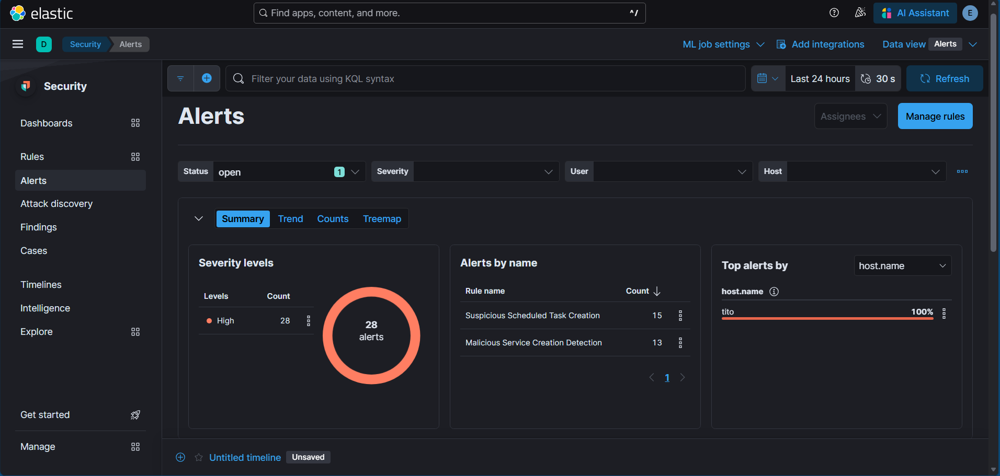
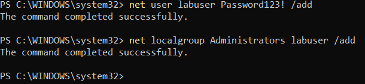
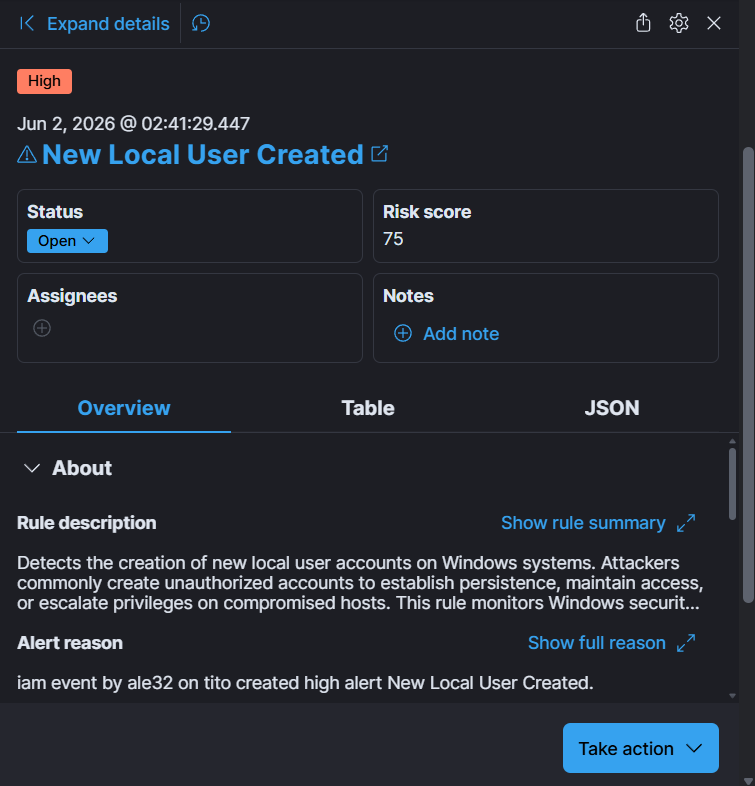

# Privilege Escalation Phase

## Objective

Simulate a privilege escalation event by creating a new local user account and adding that account to the local Administrators group. The objective was to validate Elastic SIEM detections and demonstrate visibility into account manipulation and administrative privilege assignment activity.

## MITRE ATT&CK Mapping

| Tactic | Technique | ID |
|----------|----------|----------|
| Persistence | Valid Accounts | T1078 |
| Privilege Escalation | Account Manipulation | T1098 |

---

## Activity Performed

A new local user account was created and immediately added to the local Administrators group using native Windows administration commands.

Commands executed:

```powershell
net user labuser Password123! /add
net localgroup Administrators labuser /add
```

This activity simulates a common attacker technique used by adversaries to establish privileged access on a compromised system.

---

## Evidence Collected

### Baseline Alert State



Baseline alert state prior to privilege escalation activity.

---

### Account Creation and Privilege Escalation



Successful creation of a local user account and elevation to the Administrators group.

---

### New Local User Created Alert



Elastic Security detected the creation of a new local account and generated a security alert.

---

### User Added to Administrator Group Alert


Elastic Security detected modification of local administrator group membership and generated a high-severity alert.

---

### Alerts After Privilege Escalation


Updated alert dashboard showing all detections generated following privilege escalation activity.

---

## Detection Validation

The following detection rules were successfully validated:

- New Local User Created
- User Added to Administrator Group

The generated alerts confirmed that Windows account creation and administrative group membership modification events were successfully collected, ingested by Elastic Security, processed by the detection engine, and surfaced within the SOC monitoring environment.

---

## Results

The privilege escalation simulation successfully generated Windows security telemetry and corresponding Elastic SIEM detections. The platform detected both local account creation and administrative group membership modification activity, providing visibility into attacker techniques commonly used to establish persistence and elevate privileges after initial compromise.

This exercise validated multiple custom detection rules and demonstrated the SOC platform's ability to identify and investigate account manipulation events associated with post-compromise attacker behavior.

The privilege escalation simulation successfully generated Windows security telemetry and corresponding Elastic SIEM detections. The platform detected both local account creation and administrative group membership modification activity, providing visibility into attacker techniques commonly used to establish persistence and elevate privileges after initial compromise.

This exercise validated multiple custom detection rules and demonstrated the SOC platform's ability to identify and investigate account manipulation events associated with post-compromise attacker behavior.

