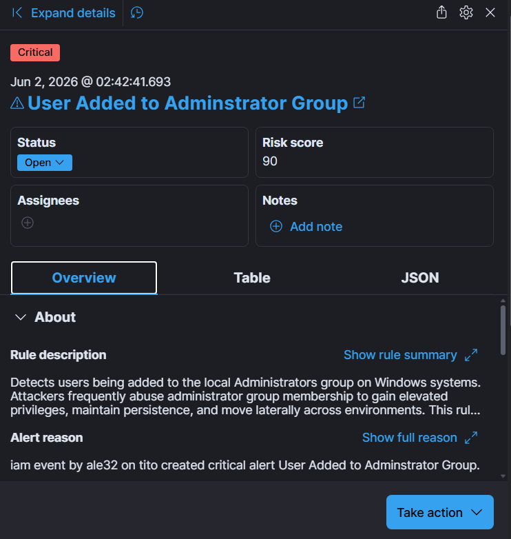

# Privilege Escalation Phase

## Objective

Simulate a privilege escalation event by creating a new local user account and adding that account to the local Administrators group. The objective was to validate Elastic SIEM detections and demonstrate visibility into account manipulation and administrative privilege assignment activity.

## MITRE ATT&CK Mapping

| Tactic               | Technique                             | ID    |
| -------------------- | ------------------------------------- | ----- |
| Persistence          | Valid Accounts                        | T1078 |
| Privilege Escalation | Account Manipulation                  | T1098 |
| Privilege Escalation | Exploitation for Privilege Escalation | T1068 |

---

## Activity Performed

A new local user account was created and immediately added to the local Administrators group using native Windows administration commands.

Commands executed:

```powershell
net user labuser Password123! /add
net localgroup Administrators labuser /add
```

This activity simulates a common attacker technique used to establish persistent administrative access on a compromised system.

---

## Evidence Collected

### Baseline Alert State


Baseline alert state prior to privilege escalation activity.

---

### Account Creation and Privilege Escalation


Successful creation of a new local user account and elevation to the Administrators group.

---

### User Added to Administrator Group Alert



Elastic Security successfully detected the administrative group modification and generated a security alert.

---

### Alerts After Privilege Escalation


Updated alert dashboard showing detection activity following privilege escalation.

---

## Detection Validation

The following detection rule was successfully validated:

* User Added to Administrator Group

The generated alert confirmed that Windows security events were successfully collected, ingested by Elastic Security, processed by the detection engine, and surfaced within the SOC monitoring environment.

---

## Results

The privilege escalation simulation successfully generated Windows security telemetry and corresponding Elastic SIEM detections. Administrative privilege assignment activity was identified, correlated, and presented through custom detection content and SOC dashboards. This exercise demonstrated the platform's ability to detect and investigate privilege escalation techniques commonly associated with post-compromise attacker behavior.

