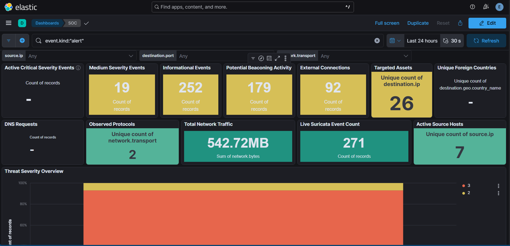
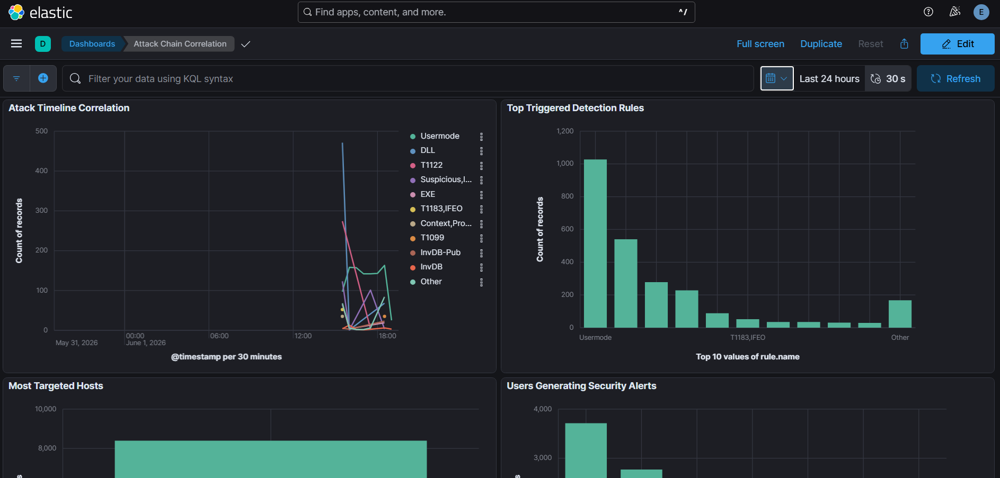
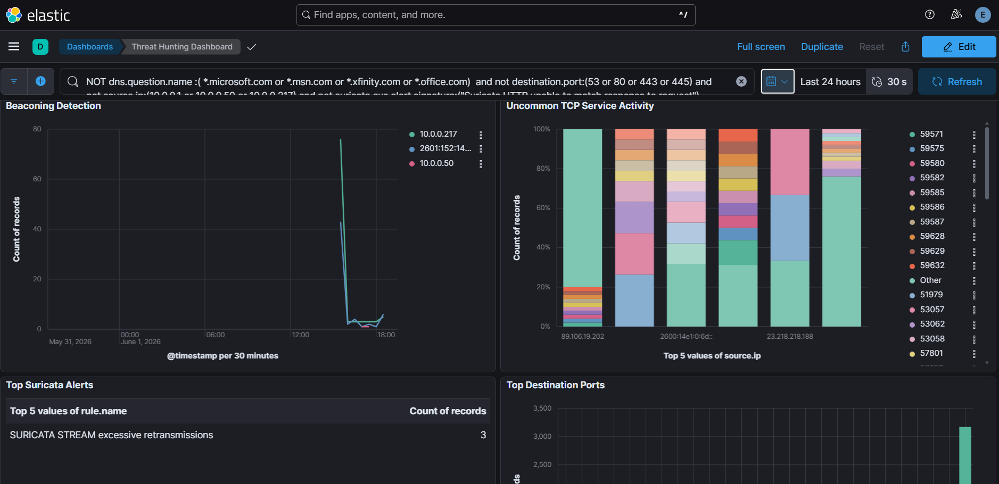
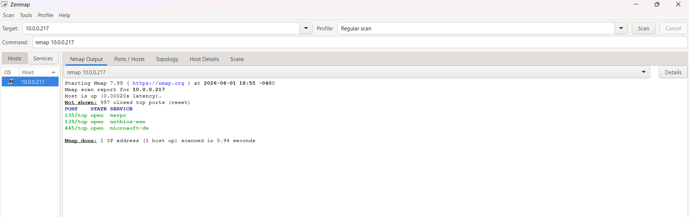

# Reconnaissance Phase

## Objective

Perform reconnaissance against the target system and capture baseline telemetry within the Elastic SIEM environment.

## Evidence Collected

### 1. SOC Dashboard After Reconnaissance

Observed increased network activity, alert generation, and external connection visibility following reconnaissance actions.

---

### 2. Attack Chain Correlation Dashboard

Correlated security detections and attack telemetry generated during reconnaissance activity.

---

### 3. Threat Hunting Dashboard

Displayed beaconing indicators, unusual TCP service activity, and Suricata detections generated during scanning.

---

### 4. Nmap Port Scan Results

Open ports discovered:

* TCP 135 (MSRPC)
* TCP 139 (NetBIOS-SSN)
* TCP 445 (SMB)

These findings established the attack surface used during subsequent phases of the attack simulation.

