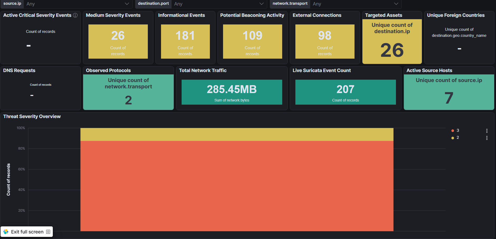
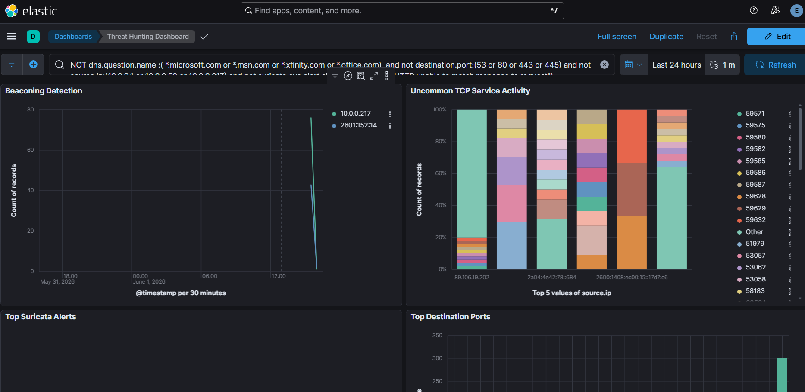
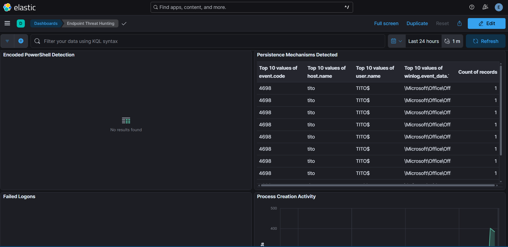
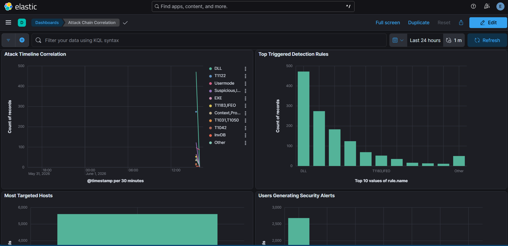
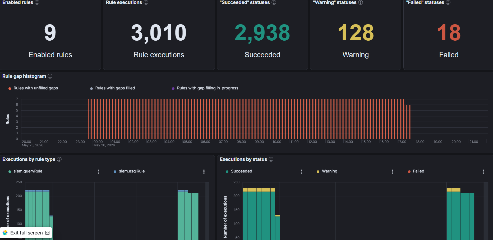

# Pre Attack Visualization
Baseline SOC dashboards and detection rules before attack simulation.
## Baseline Alert State
Security alerts present before attack simulation.

## SOC Dashboard

## Threat Hunting Dashboard

## Endpoint Threat Hunting Dashboard

## Attack Chain Correlation Dashboard

## Detection Rules Enabled

## Rule Monitoring Dashboard

